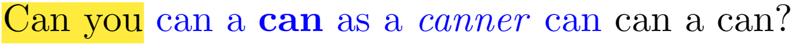
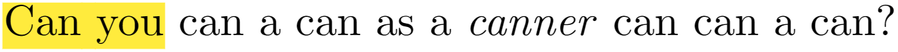

# Remove Latex command with curly brackets

## Motivation
When one Latex file is
- edited with multiple collaborators with their own mark commands `\alice{...}, \bob{...}`,
- revised with mark based on comments from reviewers,

there are many commands with curly brackets in the Latex text. This tool could remove target commands to obtain a clean source file of the manuscript for submission to arXiv, conference, and journal. 

## Usage
Run with Python 3.7. Copy `*.tex` files to be processed into `./input/` and run:
```bash
python CB_remove.py -k "revise textbf"
```
Or customize input and output paths, absolute paths are recommended.
```bash
python CB_remove.py -k "textbf" --input_dir "./outThere/" --output_dir "./somewhere/"
```

The string after `-k` determines the commands that need to be removed. In the above case, `\revise{...}` and `\textbf{...}` would be removed from the input Latex files.


## Example
Specifically, for `-k "revise textbf"`, input file with text:
```latex
\hl{Can you} \revise{can a \textbf{can} as a \emph{canner} can} can a can?
```

would be converted to:
```latex
\hl{Can you} can a can as a \emph{canner} can can a can?
```



